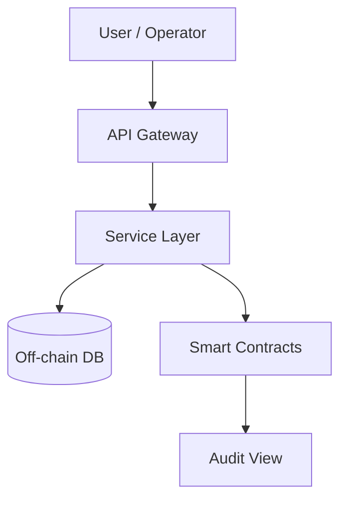

# Architecture Mermaid Template

```mermaid
flowchart TB
    U[User / Operator] --> API[API Gateway]
    API --> SVC[Service Layer]
    SVC --> DB[(Off-chain DB)]
    SVC --> CHAIN[Smart Contracts]
    CHAIN --> AUDIT[Audit View]
```

Guidance:
- include at least one end-to-end data path
- label on-chain vs off-chain boundaries
