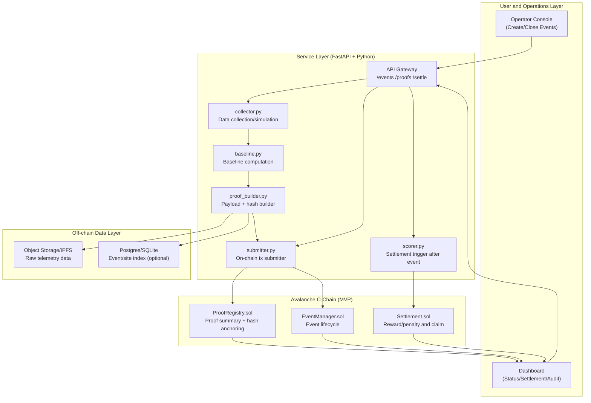
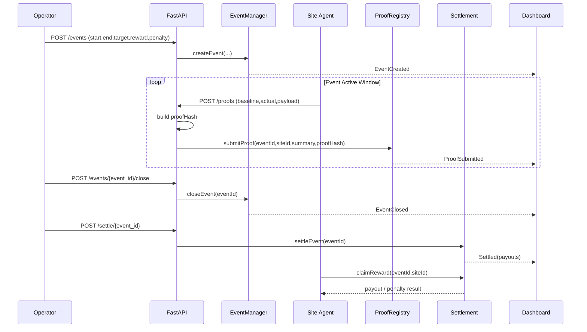

# DR Agent

[中文版本 (README_ZH.md)](README_ZH.md)

# DR Agent — Demand Response Automated Settlement

---

## Navigation

### Commercial Overview

- [1. Problem We Solve](#1-problem-we-solve)
- [2. Product Definition](#2-product-definition)
- [3. Why Now](#3-why-now)
- [4. Why Avalanche](#4-why-avalanche)
- [5. Target Customers and Value](#5-target-customers-and-value)
- [6. Business Model (MVP Stage)](#6-business-model-mvp-stage)
- [7. Competition and Differentiation](#7-competition-and-differentiation)
- [8. Risks and Mitigations](#8-risks-and-mitigations)
- [9. Suggested Milestones](#9-suggested-milestones)
- [10. Why This Builder](#10-why-this-builder)

### Technical Manual

- [0. Local Quick Start (5-Minute Loop)](#0-local-quick-start-5-minute-loop)
- [0.1 Project Structure](#01-project-structure)
- [1. Development Goal](#1-development-goal)
- [2. System Architecture](#2-system-architecture)
- [3. Contract Design (MVP)](#3-contract-design-mvp)
- [4. Data Models](#4-data-models)
- [5. Off-chain Services (Python)](#5-off-chain-services-python)
- [6. API (FastAPI)](#6-api-fastapi)
- [7. Frontend (Mission Cockpit)](#7-frontend-mission-cockpit)
- [7.1 Product-Grade Expansion Plan](#71-product-grade-expansion-plan)
- [8. 6-Week Development Plan](#8-6-week-development-plan)
- [9. Test Checklist](#9-test-checklist)
- [10. Security and Scope Boundaries](#10-security-and-scope-boundaries)
- [11. Demo and Deployment Assets](#11-demo-and-deployment-assets)
- [11.1 Testnet Contract Evidence](#111-testnet-contract-evidence)

## 1. Problem We Solve

Demand Response (DR): adjusting end-user electricity consumption patterns in response to incentive signals or market price fluctuations to balance grid supply and demand.
DR has two persistent real-world pain points:

1. Fulfillment is hard to verify

- After an event is issued, whether participants actually reduced load (and by how much) is often based on centralized reports.
- Different parties (aggregators, participants, grid operators) frequently disagree on data and outcomes.

2. Settlement is slow and manual

- Reward distribution often spans multiple systems after the event ends.
- The process is inefficient, expensive to audit, and creates trust friction for smaller participants.

## 2. Product Definition

**DR Agent** is an Avalanche-based automated settlement layer for demand response:

- Event publishing: operator/aggregator defines event time window, target reduction, and settlement rules.
- Proof submission: participants submit verifiable load-reduction proofs.
- Automated settlement: smart contracts compute rewards/penalties.
- Auditability: full lifecycle is replayable and verifiable.

One sentence:
**DR Agent upgrades DR from "human-operated workflow" to "verifiable execution + automated settlement."**

## 3. Why Now

- Grid flexibility demand is increasing.
- AI can improve event-time dispatch decisions, but a trusted shared settlement layer is missing.
- Avalanche’s app-chain and interoperability capabilities are well suited to multi-party, rule-based, auditable energy settlement.

## 4. Why Avalanche

1. Low latency and deterministic settlement for event-driven workflows.
2. Customizable L1/Subnet path for energy-specific rule encoding.
3. Interchain interoperability for splitting data, asset, and settlement domains when needed.

## 5. Target Customers and Value

### Initial customers (3-6 months after hackathon)

- Aggregators / energy service providers managing C&I portfolios.
- Industrial parks requiring peak-shaving and incentive settlement.

### Direct value

- Settlement cycle shortened from days/weeks to minutes/hours.
- Lower dispute cost (event, proof, and payout logic anchored and auditable).
- Higher trust and operational reusability among participants.

## 6. Business Model (MVP Stage)

1. Per-event settlement fee

- Charge by number of participating sites or settlement volume.

2. API/SaaS subscription

- Event management, fulfillment audit, and automated reporting for aggregators.

3. Enterprise deployment

- Private deployment + annual maintenance (later stage).

## 7. Competition and Differentiation

### Competitive landscape

- Traditional DR platforms: mature operations but mainly centralized workflows and higher audit friction.
- Generic energy data platforms: monitoring capabilities exist, but settlement closure is weak.

### Our differentiation

1. **Settlement automation**: not just another dashboard.
2. **Verifiable fulfillment**: disputes can be replayed on-chain.
3. **Programmable rule templates**: configurable for different regional DR programs.

## 8. Risks and Mitigations

1. Compliance and responsibility boundaries

- Position as settlement and audit infrastructure; no delegated dispatch promises.

2. Data authenticity

- Data signatures, device identity, anomaly checks, and dispute process.

3. Regional rule variance

- Template-based rule engine; start with one jurisdiction MVP.

## 9. Suggested Milestones

- Week 1: event model + settlement contracts + basic UI
- Week 2: proof pipeline and automated scoring
- Week 3: end-to-end stress testing and demo hardening

## 10. Why This Builder

> Huawei Digital Energy engineer with 3+ years in photovoltaic systems,
> combining embedded firmware, AI optimization, and smart contract development.

| Domain     | Experience                                                          |
| ---------- | ------------------------------------------------------------------- |
| Energy     | PV inverter firmware (embedded C) · PVEMS AI algorithm optimization |
| AI         | LSTM load forecasting · MILP dispatch optimization                  |
| Blockchain | Solidity · Chainlink Oracle · Hardhat                               |
| Education  | Zhejiang University B.S.                                            |

---

# DR Agent — Technical Development Manual

## 0. Local Quick Start (5-Minute Loop)

Environment prerequisites:

- Node.js 20.x or 22.x recommended (`hardhat` warns on Node 23).
- Python 3.10+ with `venv` available.

Step 1: install and validate contracts

```bash
npm install
npm run test:contracts
```

Step 2: bootstrap API environment and smoke test

```bash
npm run setup:api
source .venv/bin/activate
```

If your machine cannot access PyPI directly:

```bash
export PIP_INDEX_URL=<internal-mirror-url>
# or
export WHEELHOUSE_DIR=<path-to-offline-wheelhouse>
npm run setup:api
```

Step 3: initialize external secrets (outside workspace)

```bash
make secrets-init
# edit ~/.config/dr-agent/secrets.env
make secrets-check
```

Step 4: run API server (loads external secrets automatically)

```bash
make api-run
# optional probe
curl http://127.0.0.1:8000/healthz
```

Step 5: run walkthrough flow (new terminal)

```bash
make demo-run
```

Step 6: launch Mission Cockpit UI (optional)

```bash
npm run frontend:serve
# open http://127.0.0.1:4173
```

Mission Cockpit quick checks:

- Mode switch: `Story / Ops / Engineering`
- Primary actions: `Execute Next Step`, `Auto Run Full Flow`
- Judge deck includes `Proof A vs Proof B`, `One-Line Story`, and `Agent Insight`
- Stage controls: `Theme: Cobalt/Neon`, `Camera Mode`, `Judge Mode`
- Snapshot export behavior: Story/Ops copy brief summary; Engineering copies full snapshot (with JSON evidence)
- Keyboard shortcuts: `N` (next step), `R` (run full flow), `E` (switch to Engineering)

Cross-origin note:

- API allows demo UI origins by default: `http://127.0.0.1:4173,http://localhost:4173`.
- Override with `DR_CORS_ORIGINS` if needed.

Notes:

- API smoke script: `npm run smoke:api`
- Full Python dependencies (including Prophet): `npm run setup:python`
- Fuji deploy with external secrets: `make deploy-fuji`

## 0.1 Project Structure

```text
contracts/                 # Solidity contracts for event lifecycle and settlement
services/                  # FastAPI services and off-chain orchestration
scripts/                   # setup, demo, smoke, and deployment scripts
test/                      # contract tests (Hardhat)
tests/                     # API/integration tests (pytest)
frontend/                  # minimal demo UI shell
guide/                     # walkthrough, reproducibility, and judge-facing docs
docs/adr/                  # architecture decision records (ADR)
```

## 1. Development Goal

Deliver a demo-ready MVP in 6 weeks:

- Event Creation
- Proof Submission
- Automated Settlement
- Audit Query

Core principles:

- Close the end-to-end loop first, then optimize complexity.
- Keep critical states on-chain; keep high-frequency raw telemetry off-chain with hash anchoring.

## 2. System Architecture

### 2.1 Layered Architecture (Detailed)



### 2.2 Data Boundary (On-chain vs Off-chain)

1. `On-chain`: event parameters, proof summary, proof hash, settlement result, claim status.
2. `Off-chain`: high-frequency raw load curves, device logs, recomputable payload.
3. `Consistency anchor`: `proofHash = keccak256(rawPayload)` for audit-time recomputation.

### 2.3 Event-to-Settlement Sequence



## 3. Contract Design (MVP)

### 3.1 EventManager.sol

Functions:

- createEvent(eventId, start, end, targetKw, rewardRate, penaltyRate)
- closeEvent(eventId)
- getEvent(eventId)

States:

- Pending / Active / Closed / Settled

### 3.2 ProofRegistry.sol

Functions:

- submitProof(eventId, siteId, baselineKwh, actualKwh, proofHash)
- getSiteProof(eventId, siteId)

Notes:

- Store summary + hash on-chain; keep full curve off-chain (IPFS/object storage).
- proofHash = keccak256(rawPayload)

### 3.3 Settlement.sol

Functions:

- settleEvent(eventId)
- claimReward(eventId, siteId)

Simplified MVP formula:

- reduction = baselineKwh - actualKwh
- completion = reduction / targetShare
- if completion >= 1: reward = targetShare \* rewardRate
- else: reward = reduction _ rewardRate - (targetShare - reduction) _ penaltyRate

## 4. Data Models

### Event

- eventId: bytes32
- startTime/endTime: uint64
- targetKw: uint256
- rewardRate: uint256
- penaltyRate: uint256
- status: uint8

### SiteProof

- siteId: bytes32
- baselineKwh: uint256
- actualKwh: uint256
- reductionKwh: uint256
- proofHash: bytes32
- submittedAt: uint64

### SettlementRecord

- eventId: bytes32
- siteId: bytes32
- payout: int256
- settledAt: uint64

## 5. Off-chain Services (Python)

Modules:

1. `collector.py`: collect/simulate load data
2. `baseline.py`: baseline generation (7-day same-hour average for MVP)
3. `proof_builder.py`: payload + hash builder
4. `submitter.py`: orchestrate proof and settlement writes (MVP simulated tx mode)
5. `scorer.py`: settlement trigger at event end

## 6. API (FastAPI)

- `POST /events` create event
- `POST /events/{event_id}/close` close event before settlement
- `POST /proofs` submit site proof
- `POST /settle/{event_id}` trigger settlement
- `POST /claim/{event_id}/{site_id}` claim settlement payout for a site
- `GET /events/{event_id}` query event state
- `GET /events/{event_id}/records` query settlement details
- `GET /audit/{event_id}/{site_id}` verify proof hash consistency
- `GET /judge/{event_id}/summary` query aggregated judge-facing summary
- `GET /healthz` service health probe
- `GET /system/chain-mode` expose runtime chain execution mode

## 7. Frontend (Mission Cockpit)

The frontend is a judge-first `Mission Cockpit`, replacing the old multi-page split with one narrative surface.

1. Story Mode (default)

- Mission command hero with a single primary CTA: `Execute Next Step`
- Secondary CTA: `Auto Run Full Flow` for full-path demo automation
- Story KPI row: Energy Reduction, Total Payout, Audit Confidence, Agent Thinking

2. Ops Mode

- Flow timeline: `create -> proofs -> close -> settle -> claim -> audit`
- KPI grid: Status, Proof Coverage, Total Payout, Claim, Audit Match, Latency
- Unified state semantics: `pending / in-progress / done / error`
- Health is derived from the core flow steps only (query/snapshot actions do not override flow health)

3. Engineering Mode

- Technical Evidence panel with raw JSON logs for verification
- Full snapshot export including JSON evidence

Judge-facing evidence deck:

- `Proof A vs Proof B` comparison
- `Audit Anchor` hash summary (on-chain vs recomputed)
- `One-Line Story` (<=120 chars)
- `Agent Insight` (headline + reason + impact)

Keyboard shortcuts:

- `N`: Execute Next Step
- `R`: Auto Run Full Flow
- `E`: Switch to Engineering Mode

`Auto Run Full Flow` execution order:

- `createEvent -> submitProof(site-a) -> submitProof(site-b) -> closeEvent -> settleEvent -> claim(site-a) -> getEvent -> getRecords -> getAudit`

### 7.1 Product-Grade Expansion Plan

1. Typed API and domain contracts

- Generate and use a typed client for all frontend API calls.
- Keep UI state models aligned with backend response schemas.

2. Auth, RBAC, and resilient UX states

- Enforce role boundaries for operator, participant, and auditor actions.
- Cover loading, empty, stale, and error states on every key view.

3. Observability and audit alignment

- Standardize frontend event logs and include trace identifiers on failures.
- Keep operation records consistent with on-chain events and API logs.

4. Release hardening and E2E gates

- Add end-to-end tests for event creation, proof submission, settlement, and audit.
- Complete release checklist before demo or production rollout.

## 8. 6-Week Development Plan

### Week 1

- Build 3 core contracts + unit tests

### Week 2

- Run local flow: createEvent -> submitProof -> closeEvent -> settle
- Contract integration tests

### Week 3

- Wrap chain interactions with FastAPI

### Week 4

- Integrate frontend query/trigger actions
- Simulate 2-3 site datasets

### Week 5

- Add exception scenarios (late proof, missing data, under-performance)

### Week 6

- End-to-end stress test
- Harden demo script and recording flow

## 9. Test Checklist

### Contract tests

1. happy path: create, submit, settle, claim
2. duplicate proof prevention
3. invalid time window rejection
4. cannot settle before closure
5. no double settlement

### Integration tests

1. continuous reporting during event window
2. settlement only after explicit close event
3. UI state consistent with on-chain state

### Demo tests

1. full walkthrough within 5 minutes
2. random proofHash recomputation checks
3. explainable failure behavior

## 10. Security and Scope Boundaries

1. Access control

- only operator can create/close events
- only participant role can submit proof (site registry is a planned enhancement)

2. Data integrity

- signed payload + on-chain hash anchoring
- keep auditable raw data window

3. Out of MVP scope

- no direct control of real grid dispatch
- no advanced multi-market rule engine
- no cross-jurisdiction compliance engine

## 11. Demo and Deployment Assets

- Frontend shell: `frontend/index.html`
- Frontend logic: `frontend/app.js`
- Frontend styling: `frontend/styles.css`
- End-to-end walkthrough script: `scripts/demo_walkthrough.sh`
- API setup script: `scripts/setup_python_env.sh`
- API smoke script: `scripts/smoke_api_flow.py`
- Fuji deployment script: `scripts/deploy_fuji.ts`
- Walkthrough doc: `guide/docs/DR-Agent-Walkthrough-2026-02-17.md`
- Fuji deployment record: `guide/docs/Fuji-Deployment-Record-2026-02-17.md`
- Fuji deployment record template: `guide/docs/Fuji-Deployment-Record-Template.md`
- Reproducibility runbook: `guide/docs/DR-Agent-Reproducibility-Runbook-2026-02-17.md`
- ADR record: `docs/adr/0001-record-architecture-decisions.md`

## 11.1 Testnet Contract Evidence

Status:
- Blocked in current environment because `PRIVATE_KEY` and Fuji test AVAX are not configured.
- Deployment evidence source: `cache/fuji-deployment-latest.json` (generated by `npm run deploy:fuji`).

Current record:

| Network | Contract | Explorer URL |
| --- | --- | --- |
| Fuji | Pending real deployment | Pending real deployment |

How to complete:
1. Configure `PRIVATE_KEY` and prepare Fuji test AVAX.
2. Run `npm run deploy:fuji`.
3. Copy real addresses from `cache/fuji-deployment-latest.json` into the table above and link Snowtrace URLs.
