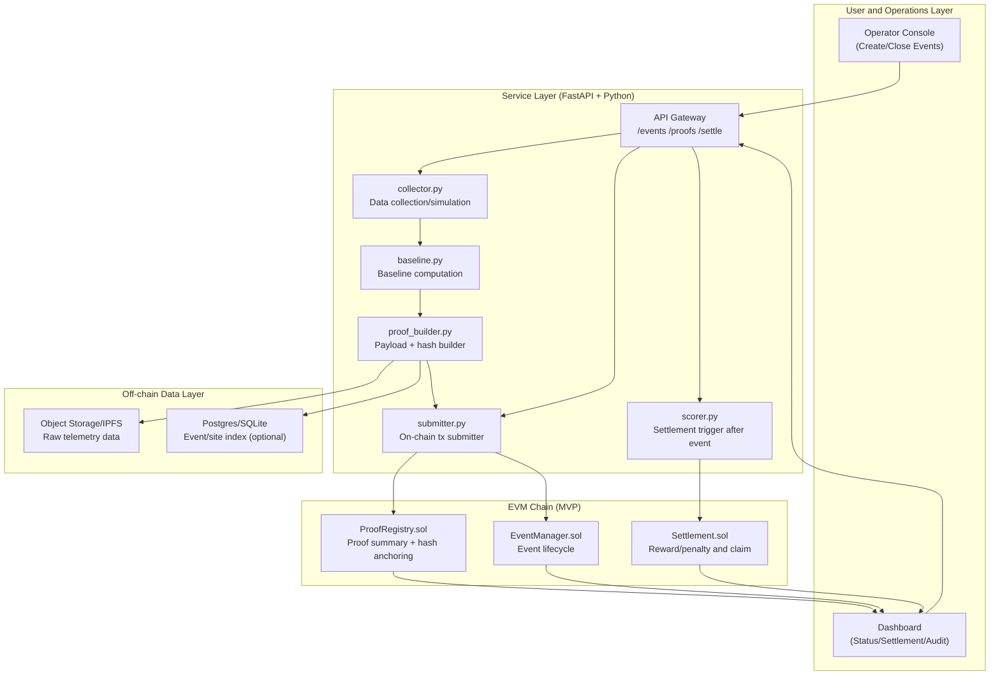
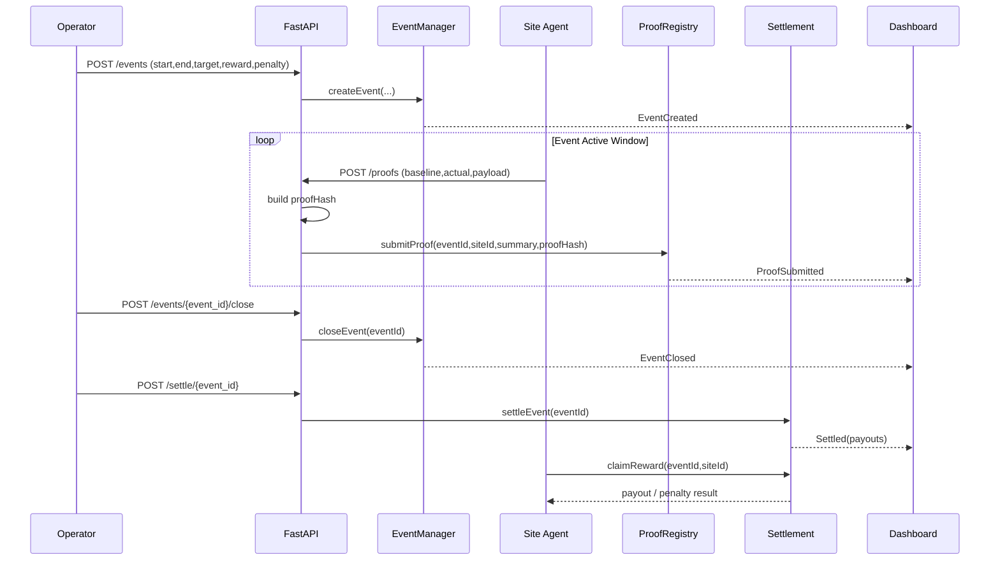

# DR Agent

[中文版本 (README_ZH.md)](README_ZH.md)

# DR Agent — Demand Response Automated Settlement

---

## Navigation

### Commercial Overview

- [1. Problem We Solve](#1-problem-we-solve)
- [2. Product Definition](#2-product-definition)
- [3. Why Now](#3-why-now)
- [4. Network and Deployment Strategy](#4-network-and-deployment-strategy)
- [5. Target Customers and Value](#5-target-customers-and-value)
- [6. Business Model (MVP Stage)](#6-business-model-mvp-stage)
- [7. Competition and Differentiation](#7-competition-and-differentiation)
- [8. Risks and Mitigations](#8-risks-and-mitigations)
- [9. Completed Progress and Next Milestones (Weekly)](#9-completed-progress-and-next-milestones-weekly)
- [10. Why This Builder](#10-why-this-builder)

### Technical Manual

- [0. Local Quick Start (5-Minute Loop)](#0-local-quick-start-5-minute-loop)
- [0.1 Project Structure](#01-project-structure)
- [1. Development Goal](#1-development-goal)
- [2. System Architecture](#2-system-architecture)
- [3. Contract Design (MVP)](#3-contract-design-mvp)
- [4. Data Models](#4-data-models)
- [5. Off-chain Services (Python)](#5-off-chain-services-python)
- [6. API (FastAPI)](#6-api-fastapi)
- [7. Frontend (Mission Cockpit)](#7-frontend-mission-cockpit)
- [7.1 Product-Grade Expansion Plan](#71-product-grade-expansion-plan)
- [8. Completed Progress and Weekly Plan](#8-completed-progress-and-weekly-plan)
- [9. Test Checklist](#9-test-checklist)
- [10. Security and Scope Boundaries](#10-security-and-scope-boundaries)
- [11. Demo and Deployment Assets](#11-demo-and-deployment-assets)
- [11.1 Testnet Contract Evidence](#111-testnet-contract-evidence)

## 1. Problem We Solve

Demand Response (DR): adjusting end-user electricity consumption patterns in response to incentive signals or market price fluctuations to balance grid supply and demand.
DR has two persistent real-world pain points:

1. Fulfillment is hard to verify

- After an event is issued, whether participants actually reduced load (and by how much) is often based on centralized reports.
- Different parties (aggregators, participants, grid operators) frequently disagree on data and outcomes.

2. Settlement is slow and manual

- Reward distribution often spans multiple systems after the event ends.
- The process is inefficient, expensive to audit, and creates trust friction for smaller participants.

## 2. Product Definition

**DR Agent** is an EVM-compatible automated settlement layer for demand response:

- Event publishing: operator/aggregator defines event time window, target reduction, and settlement rules.
- Proof submission: participants submit verifiable load-reduction proofs.
- Automated settlement: smart contracts compute rewards/penalties.
- Auditability: full lifecycle is replayable and verifiable.
- Core enhancement: **Energy Oracle Layer** converts off-chain telemetry into on-chain verifiable proof
  (`telemetry -> baseline inference -> confidence metadata -> proof hash anchoring`).

One sentence:
**DR Agent upgrades DR from "human-operated workflow" to "verifiable execution + automated settlement."**

## 3. Why Now

- Grid flexibility demand is increasing.
- AI can improve event-time dispatch decisions, but a trusted shared settlement layer is missing.
- A modular EVM deployment strategy is well suited to multi-party, rule-based, auditable energy settlement.

## 4. Network and Deployment Strategy

1. **Chain-agnostic contracts**: core contracts stay EVM-compatible and keep the same event/proof/settlement lifecycle across environments.
2. **Testnet-first verification**: live mode can run on EVM testnets for real tx proofs while preserving the same API semantics.
3. **Progressive hardening path**: local simulation -> testnet live tx -> stricter deployment and governance policies as the protocol matures.

## 5. Target Customers and Value

### Initial customers (3-6 months after hackathon)

- Aggregators / energy service providers managing C&I portfolios.
- Industrial parks requiring peak-shaving and incentive settlement.

### Direct value

- Settlement cycle shortened from days/weeks to minutes/hours.
- Lower dispute cost (event, proof, and payout logic anchored and auditable).
- Higher trust and operational reusability among participants.

## 6. Business Model (MVP Stage)

1. Per-event settlement fee

- Charge by number of participating sites or settlement volume.

2. API/SaaS subscription

- Event management, fulfillment audit, and automated reporting for aggregators.

3. Enterprise deployment

- Private deployment + annual maintenance (later stage).

## 7. Competition and Differentiation

### Competitive landscape

- Traditional DR platforms: mature operations but mainly centralized workflows and higher audit friction.
- Generic energy data platforms: monitoring capabilities exist, but settlement closure is weak.

### Our differentiation

1. **Energy Oracle Layer**: baseline inference + confidence metadata + on-chain proof anchoring in one pipeline.
2. **On-chain token settlement**: DRT (ERC-20) payout on claim — completing the settlement loop with real on-chain value transfer.
3. **Cross-network token liquidity (optional)**: DRT can be bridged to external liquidity venues when needed.
4. **AI load / compute flexibility scenarios**: extends DR from industrial loads to AI-era flexible compute demand.
5. **M2M settlement and incentives**: machine-account-based programmable reward distribution.
6. **Modular growth path**: testnet MVP -> dedicated execution environment -> cross-domain interoperability -> domain-specific precompiles.

## 8. Risks and Mitigations

1. Compliance and responsibility boundaries

- Position as settlement and audit infrastructure; no delegated dispatch promises.

2. Data authenticity

- Data signatures, device identity, anomaly checks, and dispute process.

3. Regional rule variance

- Template-based rule engine; start with one jurisdiction MVP.

## 9. Completed Progress and Next Milestones

Completed (as of 2026-02-24):
- Core loop is running end-to-end: `create -> proofs -> close -> settle -> claim -> audit`
- Contract suite remains stable (`15 passing`)
- Frontend modes, bilingual toggle, snapshot export, and chart-based readouts are in place
- network integration analysis completed: delivery scope vs long-term architecture clearly scoped

Hackathon deliverables (prioritized):
- **P0**: DRT token (ERC-20) + `claimReward()` real token transfer (~1 day)
- **P0**: Custom L1 configuration blueprint with multi-region architecture diagram (~0.5 day)
- **P1**: ICTT cross-chain token bridge (ERC20TokenHome on C-Chain + ERC20TokenRemote) (~1-2 days)
- **P1**: Energy Oracle Layer default-in-path with model metadata persistence
- **P2**: explorer links in frontend, Prophet auto-invocation

Startup vision (documented in roadmap, no code):
- 6 months: ICM multi-region proof verification across grid operators
- 12 months: Custom precompiles for zk-SNARK proof validation
- 18 months: HyperSDK DR-VM for native settlement throughput
- 24 months: Validator economy — meter operators stake as DR-L1 validators

## 10. Why This Builder

> Huawei Digital Energy engineer with 3+ years in photovoltaic systems,
> combining embedded firmware, AI optimization, and smart contract development.

| Domain     | Experience                                                          |
| ---------- | ------------------------------------------------------------------- |
| Energy     | PV inverter firmware (embedded C) · PVEMS AI algorithm optimization |
| AI         | LSTM load forecasting · MILP dispatch optimization                  |
| Blockchain | Solidity · Chainlink Oracle · Hardhat                               |
| Education  | Zhejiang University B.S.                                            |

---

# DR Agent — Technical Development Manual

## 0. Local Quick Start (5-Minute Loop)

Environment prerequisites:

- Node.js 20.x or 22.x recommended (`hardhat` warns on Node 23).
- Python 3.10+ with `venv` available.

Step 1: install and validate contracts

```bash
npm install
npm run test:contracts
```

Step 2: bootstrap API environment and smoke test

```bash
npm run setup:api
source .venv/bin/activate
```

If your machine cannot access PyPI directly:

```bash
export PIP_INDEX_URL=<internal-mirror-url>
# or
export WHEELHOUSE_DIR=<path-to-offline-wheelhouse>
npm run setup:api
```

Step 3: initialize external secrets (outside workspace)

```bash
make secrets-init
# edit ~/.config/dr-agent/secrets.env
make secrets-check
```

Step 4: run API server (loads external secrets automatically)

```bash
make api-run
# optional probe
curl http://127.0.0.1:8000/healthz
```

Step 5: run walkthrough flow (new terminal)

```bash
make demo-run
```

For live Fuji demo (default: full dual-site loop + hybrid confirmation), use:

```bash
export DR_CHAIN_MODE=fuji-live
export DR_TX_CONFIRM_MODE=hybrid
export DR_DEMO_SITE_MODE=dual
make demo-run
# or
npm run demo:walkthrough:live
```

If you need temporary lower faucet AVAX burn, switch to:

```bash
export DR_DEMO_SITE_MODE=single
make demo-run
```

After demo, generated tx hashes are available at:

- summary: `cache/demo-tx-<event_id>.json`
- evidence: `cache/demo-evidence-<event_id>.json`
- step raw responses: `cache/demo-raw-<event_id>/`
- local db tables: `cache/dr_agent.db` in `events/proofs/settlements`
- live evidence markdown (internal archive under `guide/`, auto-generated in Fuji mode)

Step 6: launch Mission Cockpit UI (optional)

```bash
npm run frontend:serve
# open http://127.0.0.1:4173
```

Mission Cockpit quick checks:

- Mode switch: `Story / Ops / Engineering`
- Language toggle: `EN / 中文` (default `EN`, persisted via `localStorage['dr_lang']`)
- Primary actions: `Execute Next Step`, `Auto Run Full Flow`
- Review deck includes `Proof A vs Proof B`, `One-Line Story`, and `Agent Insight`
- Stage controls: `Theme: Cobalt/Neon`, `Camera Mode`, `Review Mode`
- Snapshot export behavior: Story/Ops copy brief summary; Engineering copies full snapshot (with JSON evidence)
- Keyboard shortcuts: `N` (next step), `R` (run full flow), `E` (switch to Engineering)

Cross-origin note:

- API allows demo UI origins by default: `http://127.0.0.1:4173,http://localhost:4173`.
- Override with `DR_CORS_ORIGINS` if needed.

Notes:

- API smoke script: `npm run smoke:api`
- Full Python dependencies (including Prophet): `npm run setup:python`
- Fuji deploy with external secrets: `make deploy-fuji`
- DRT-only Fuji deploy: `make deploy-fuji-drt`
- DRT-only deploy + evidence: `make deploy-fuji-drt-evidence`
- For live-demo mode confirmation: `curl http://127.0.0.1:8000/system/chain-mode` (includes `tx_confirm_mode`)

## 0.1 Project Structure

```text
contracts/                 # Solidity contracts for event lifecycle and settlement
services/                  # FastAPI services and off-chain orchestration
scripts/                   # setup, demo, smoke, and deployment scripts
test/                      # contract tests (Hardhat)
tests/                     # API/integration tests (pytest)
frontend/                  # minimal demo UI shell
docs/module-design/        # module architecture design docs (main repository)
docs/adr/                  # architecture decision records (main repository)
resources/                 # reference resources and source materials
guide/                     # internal documentation module (NOT for external submission)
```

Documentation boundary:

- External-facing materials should be limited to repository code + reproducible commands + generated artifacts under `cache/` + `docs/module-design/`.
- `docs/adr/` and `resources/` are engineering reference materials for architecture context and source study.
- Anything under `guide/` is internal working documentation and should not be exposed in external review packets.

## 1. Development Goal

Deliver a demo-ready MVP in 6 weeks:

- Event Creation
- Proof Submission
- Automated Settlement
- Audit Query

Core principles:

- Close the end-to-end loop first, then optimize complexity.
- Keep critical states on-chain; keep high-frequency raw telemetry off-chain with hash anchoring.

## 2. System Architecture

### 2.1 Layered Architecture (Detailed)


```mermaid
flowchart TB
    subgraph U["User and Operations Layer"]
        OP["Operator Console\n(Create/Close Events)"]
        DB["Dashboard\n(Status/Settlement/Audit)"]
    end

    subgraph S["Service Layer (FastAPI + Python)"]
        API["API Gateway\n/events /proofs /settle"]
        C["collector.py\nData collection/simulation"]
        B["baseline.py\nBaseline computation"]
        P["proof_builder.py\nPayload + hash builder"]
        SUB["submitter.py\nOn-chain tx submitter"]
        SC["scorer.py\nSettlement trigger after event"]
    end

    subgraph O["Off-chain Data Layer"]
        RAW["Object Storage/IPFS\nRaw telemetry data"]
        IDX["Postgres/SQLite\nEvent/site index (optional)"]
    end

    subgraph A["EVM Chain (MVP)"]
        EM["EventManager.sol\nEvent lifecycle"]
        PR["ProofRegistry.sol\nProof summary + hash anchoring"]
        ST["Settlement.sol\nReward/penalty and claim"]
    end

    OP --> API
    DB --> API
    API --> C --> B --> P
    P --> RAW
    P --> IDX
    P --> SUB --> PR
    API --> SUB --> EM
    API --> SC --> ST
    ST --> DB
    EM --> DB
    PR --> DB
```

### 2.2 Data Boundary (On-chain vs Off-chain)

1. `On-chain`: event parameters, proof summary, proof hash, settlement result, claim status.
2. `Off-chain`: high-frequency raw load curves, device logs, recomputable payload.
3. `Consistency anchor`: `proofHash = keccak256(rawPayload)` for audit-time recomputation.

### 2.3 Event-to-Settlement Sequence


```mermaid
sequenceDiagram
    participant O as Operator
    participant API as FastAPI
    participant EM as EventManager
    participant AG as Site Agent
    participant PR as ProofRegistry
    participant ST as Settlement
    participant D as Dashboard

    O->>API: POST /events (start,end,target,reward,penalty)
    API->>EM: createEvent(...)
    EM-->>D: EventCreated

    loop Event Active Window
        AG->>API: POST /proofs (baseline,actual,payload)
        API->>API: build proofHash
        API->>PR: submitProof(eventId,siteId,summary,proofHash)
        PR-->>D: ProofSubmitted
    end

    O->>API: POST /events/{event_id}/close
    API->>EM: closeEvent(eventId)
    EM-->>D: EventClosed

    O->>API: POST /settle/{event_id}
    API->>ST: settleEvent(eventId)
    ST-->>D: Settled(payouts)

    AG->>ST: claimReward(eventId,siteId)
    ST-->>AG: payout / penalty result
```

## 3. Contract Design (MVP)

### 3.1 EventManager.sol

Functions:

- createEvent(eventId, start, end, targetKw, rewardRate, penaltyRate)
- closeEvent(eventId)
- getEvent(eventId)

States:

- Pending / Active / Closed / Settled

### 3.2 ProofRegistry.sol

Functions:

- submitProof(eventId, siteId, baselineKwh, actualKwh, proofHash)
- getSiteProof(eventId, siteId)

Notes:

- Store summary + hash on-chain; keep full curve off-chain (IPFS/object storage).
- proofHash = keccak256(rawPayload)

### 3.3 Settlement.sol

Functions:

- settleEvent(eventId)
- claimReward(eventId, siteId)

Simplified MVP formula:

- reduction = baselineKwh - actualKwh
- completion = reduction / targetShare
- if completion >= 1: reward = targetShare \* rewardRate
- else: reward = reduction _ rewardRate - (targetShare - reduction) _ penaltyRate

## 4. Data Models

### Event

- eventId: bytes32
- startTime/endTime: uint64
- targetKw: uint256
- rewardRate: uint256
- penaltyRate: uint256
- status: uint8

### SiteProof

- siteId: bytes32
- baselineKwh: uint256
- actualKwh: uint256
- reductionKwh: uint256
- proofHash: bytes32
- submittedAt: uint64

### SettlementRecord

- eventId: bytes32
- siteId: bytes32
- payout: int256
- settledAt: uint64

## 5. Off-chain Services (Python)

Modules:

1. `collector.py`: collect/simulate load data
2. `baseline.py`: baseline generation (7-day same-hour average for MVP)
3. `proof_builder.py`: payload + hash builder
4. `submitter.py`: orchestrate proof and settlement writes (MVP simulated tx mode)
5. `scorer.py`: settlement trigger at event end

Mode notes:

- `DR_CHAIN_MODE=simulated` (default): API returns simulated tx hashes.
- `DR_CHAIN_MODE=fuji-live` (or `fuji`): API submits real Fuji transactions and returns real tx hashes.
- `DR_TX_CONFIRM_MODE=hybrid` (default): write APIs return quickly with `tx_state=submitted`, then backfill `tx_fee_wei/tx_confirmed_at`.
- `DR_TX_CONFIRM_MODE=sync`: each write waits for receipt and returns confirmed fee immediately.

## 6. API (FastAPI)

- `POST /events` create event
- `POST /events/{event_id}/close` close event before settlement
- `POST /proofs` submit site proof
- `POST /settle/{event_id}` trigger settlement
- `POST /claim/{event_id}/{site_id}` claim settlement payout for a site
- `GET /events/{event_id}` query event state
- `GET /events/{event_id}/records` query settlement details
- `GET /audit/{event_id}/{site_id}` verify proof hash consistency
- `GET /judge/{event_id}/summary` query aggregated execution summary
- `GET /healthz` service health probe
- `GET /system/chain-mode` expose runtime chain mode + tx confirm mode + demo site mode + required proof sites

## 7. Frontend (Mission Cockpit)

The frontend is a demo-first `Mission Cockpit`, replacing the old multi-page split with one narrative surface.

1. Story Mode (default)

- Mission command hero with a single primary CTA: `Execute Next Step`
- Secondary CTA: `Auto Run Full Flow` for full-path demo automation
- Story KPI row: Energy Reduction, Total Payout, Audit Confidence, Agent Thinking
- Built-in language switch: `EN / 中文` (English default for live demos; Chinese for local walkthrough)

2. Ops Mode

- Flow timeline: `create -> proofs -> close -> settle -> claim -> audit`
- KPI grid: Status, Proof Coverage, Total Payout, Claim, Audit Match, Latency
- Unified state semantics: `pending / in-progress / done / error`
- Health is derived from the core flow steps only (query/snapshot actions do not override flow health)

3. Engineering Mode

- Technical Evidence panel with raw JSON logs for verification
- Full snapshot export including JSON evidence

Review evidence deck:

- `Proof A vs Proof B` comparison
- `Audit Anchor` hash summary (on-chain vs recomputed)
- `One-Line Story` (<=120 chars)
- `Agent Insight` (headline + reason + impact)
- Live tx status semantics: `submitted / confirmed / failed` are visible in KPI hints and technical logs

Keyboard shortcuts:

- `N`: Execute Next Step
- `R`: Auto Run Full Flow
- `E`: Switch to Engineering Mode

`Auto Run Full Flow` execution order:

- `createEvent -> submitProof(site-a) -> submitProof(site-b) -> closeEvent -> settleEvent -> claim(site-a) -> getAudit`

### 7.1 Product-Grade Expansion Plan

1. Typed API and domain contracts

- Generate and use a typed client for all frontend API calls.
- Keep UI state models aligned with backend response schemas.

2. Auth, RBAC, and resilient UX states

- Enforce role boundaries for operator, participant, and auditor actions.
- Cover loading, empty, stale, and error states on every key view.

3. Observability and audit alignment

- Standardize frontend event logs and include trace identifiers on failures.
- Keep operation records consistent with on-chain events and API logs.

4. Release hardening and E2E gates

- Add end-to-end tests for event creation, proof submission, settlement, and audit.
- Complete release checklist before demo or production rollout.

## 8. Completed Progress and Weekly Plan

### Completed progress (as of 2026-02-24)

1. End-to-end MVP loop is running:
- `create -> proofs -> close -> settle -> claim -> audit`
- Contract tests remain green (`15 passing`).

2. Live-chain demo capability is available:
- `DR_CHAIN_MODE=fuji-live` supports real Fuji transactions.
- Tx status model (`submitted/confirmed/failed`) and evidence outputs are wired.

3. Mission Cockpit has reached demo-ready usability:
- `Story / Ops / Engineering` modes
- `Execute Next Step` / `Auto Run Full Flow`
- EN/中文 switching with persistence
- Dynamic KPI/evidence rendering and snapshot export

4. Baseline/payout visual evidence has been added to Story flow:
- Baseline vs Actual chart
- Payout breakdown chart

5. network integration analysis completed:
- Scoped hackathon deliverables: DRT token + ICTT bridge + Custom L1 blueprint
- Scoped startup vision: ICM multi-region + precompiles + HyperSDK + validator economy

### Execution plan

1. DRT token + claimReward transfer (P0, ~1 day)
- Deploy `DRToken.sol` (ERC-20, initial mint to Settlement contract).
- Modify `Settlement.sol` to call `rewardToken.transfer()` on claim.
- Frontend: display DRT token balance after claim.

2. Custom L1 configuration blueprint (P0, ~0.5 day)
- `genesis.json` config with `txAllowList`, `deployerAllowList`, custom fee parameters.
- Technical justification: why DR settlement needs a dedicated L1.
- Multi-region expansion architecture diagram (ICM vision).

3. ICTT cross-chain token bridge (P1, ~1-2 days)
- Deploy `ERC20TokenHome` on Fuji C-Chain.
- Deploy `ERC20TokenRemote` on test L1.
- Demo: DRT cross-chain transfer flow.

4. Energy Oracle Layer default path (P1)
- Make `telemetry -> baseline -> confidence -> proof hash` the default proof-generation path.
- Return and persist `baseline_method`, `baseline_model_version`, `baseline_confidence`.

5. Polish and evidence (P2)
- Explorer links in frontend (~10 lines).
- Prophet auto-invocation in baseline service (~30 lines).

## 9. Test Checklist

### Contract tests

1. happy path: create, submit, settle, claim
2. duplicate proof prevention
3. invalid time window rejection
4. cannot settle before closure
5. no double settlement

### Integration tests

1. continuous reporting during event window
2. settlement only after explicit close event
3. UI state consistent with on-chain state

### Demo tests

1. full walkthrough within 5 minutes
2. random proofHash recomputation checks
3. explainable failure behavior

## 10. Security and Scope Boundaries

1. Access control

- only operator can create/close events
- only participant role can submit proof (site registry is a planned enhancement)

2. Data integrity

- signed payload + on-chain hash anchoring
- keep auditable raw data window

3. Out of MVP scope

- no direct control of real grid dispatch
- no advanced multi-market rule engine
- no cross-jurisdiction compliance engine

## 11. Demo and Deployment Assets

- Frontend shell: `frontend/index.html`
- Frontend logic: `frontend/app.js`
- Frontend styling: `frontend/styles.css`
- End-to-end walkthrough script: `scripts/demo_walkthrough.sh`
- API setup script: `scripts/setup_python_env.sh`
- API smoke script: `scripts/smoke_api_flow.py`
- Fuji deployment script: `scripts/deploy_fuji.ts`
- DRT-only Fuji deployment script: `scripts/deploy_drt_fuji.ts`
- Pitch deck sync script: `scripts/sync_pitch_pptx.py`
- Final pitch deck (PPTX): `guide/ppt/DR-Agent-Verifiable-Demand-Response-Auto-Settlement-final.pptx`
- Execution evidence bundle script: `scripts/build_execution_evidence_bundle.py`
- DRT-only evidence bundle script: `scripts/build_drt_evidence_bundle.py`
- Generated demo tx summary: `cache/demo-tx-<event_id>.json`
- Generated demo evidence summary: `cache/demo-evidence-<event_id>.json`
- Generated step raw responses: `cache/demo-raw-<event_id>/`
- Module architecture docs (main repository): `docs/module-design/`
- Architecture decisions (main repository): `docs/adr/`
- Source/reference resources (main repository): `resources/`
- Internal documentation module (not external): `guide/`

## 11.1 Testnet Contract Evidence

Status:

- Fuji deployment completed on `2026-02-20`.
- Evidence source: `cache/fuji-deployment-latest.json` (internal markdown bundle archived in `guide/`).
- DRT-only evidence source: `cache/fuji-drt-deployment-latest.json` (internal markdown bundle archived in `guide/`).

Current record:

| Network | Item                     | Value                                                                | Explorer URL                                                                                       |
| ------- | ------------------------ | -------------------------------------------------------------------- | -------------------------------------------------------------------------------------------------- |
| Fuji    | Deployer                 | `0xdC1DE25053196bb72e09db43EE34181D1e65cF0A`                         | -                                                                                                  |
| Fuji    | EventManager             | `0x388C76A617d67137CCF91A3C9B48c0779502484c`                         | https://testnet.snowtrace.io/address/0x388C76A617d67137CCF91A3C9B48c0779502484c                    |
| Fuji    | ProofRegistry            | `0x05689d6aa1f83ed4854EA0F84f7f96B48133750D`                         | https://testnet.snowtrace.io/address/0x05689d6aa1f83ed4854EA0F84f7f96B48133750D                    |
| Fuji    | Settlement               | `0x69512B18109BA25Df3A5cA27d30521EE60b7a787`                         | https://testnet.snowtrace.io/address/0x69512B18109BA25Df3A5cA27d30521EE60b7a787                    |
| Fuji    | setSettlementContract tx | `0xaffbb344ecfec8601313ec452e857f31346c72c5ba0a1e6b6166315b38a2831f` | https://testnet.snowtrace.io/tx/0xaffbb344ecfec8601313ec452e857f31346c72c5ba0a1e6b6166315b38a2831f |

Latest DRT-only evidence index:

- Generated at (UTC): `2026-03-06T11:31:13Z`
- DRT contract: `0x7c3B54f956D95E7F5756dE7684Cf5D893556E6B2`  
  Explorer: https://testnet.snowtrace.io/address/0x7c3B54f956D95E7F5756dE7684Cf5D893556E6B2
- Deploy tx: `0x3aa757cfc293be3a801d663306cd3142ffc91a62eb177947809ff4d5d98ecdef`  
  Explorer: https://testnet.snowtrace.io/tx/0x3aa757cfc293be3a801d663306cd3142ffc91a62eb177947809ff4d5d98ecdef
- Total deploy fee (wei): `1977874`
- One-shot reproduce command: `npm run deploy:fuji:drt:evidence`
- Detailed evidence paths:
  `cache/fuji-drt-deployment-latest.json`,
  `guide/docs/Fuji-DRT-Evidence-Bundle-latest.md`

Maintenance flow:

1. Re-deploy when needed with `npm run deploy:fuji`.
2. Rebuild evidence bundle with `npm run evidence:execution`.
3. For DRT-only deploy, run `npm run deploy:fuji:drt`.
4. For DRT-only evidence, run `npm run evidence:execution:drt` (or one-shot `npm run deploy:fuji:drt:evidence`).
5. Keep this table in sync with generated cache artifacts; update internal docs in `guide/` only as needed.

## 11.2 Stage-2 72-Hour Submission Kit (Minimum Winning Scope)

One-click DRT deploy + evidence:

```bash
npm run deploy:fuji:drt:evidence
# or
make deploy-fuji-drt-evidence
```

If `@openzeppelin/contracts` is missing:

```bash
npm i -D @openzeppelin/contracts
```

3-day execution priorities:

1. Day 1 (P0): lock a reproducible Fuji full loop with minimum evidence set (`event_id`, 6-step tx hashes, `tx_state`, total fee, audit match, explorer links).
2. Day 2 (P1): tighten demo UX (4 key Story cards, latency split, one-click retry + actionable error hints).
3. Day 3 (P2): final recording (<=5 min), README evidence sync, and command-level regression checks.

5-minute demo timeline:

1. `0:00-0:40` pain point.
2. `0:40-1:40` solution architecture.
3. `1:40-3:30` live flow + tx/audit evidence.
4. `3:30-4:20` evidence bundle walkthrough.
5. `4:20-5:00` value + next 4-week roadmap.

Ready-to-submit answers were moved to:

- `guide/stage2/stage2-submission-qa.md`

Internal full playbook (history): `guide/docs/history/legacy-competition/DR-Agent-stage2-72h-min-winning-plan-2026-03-06.md`
