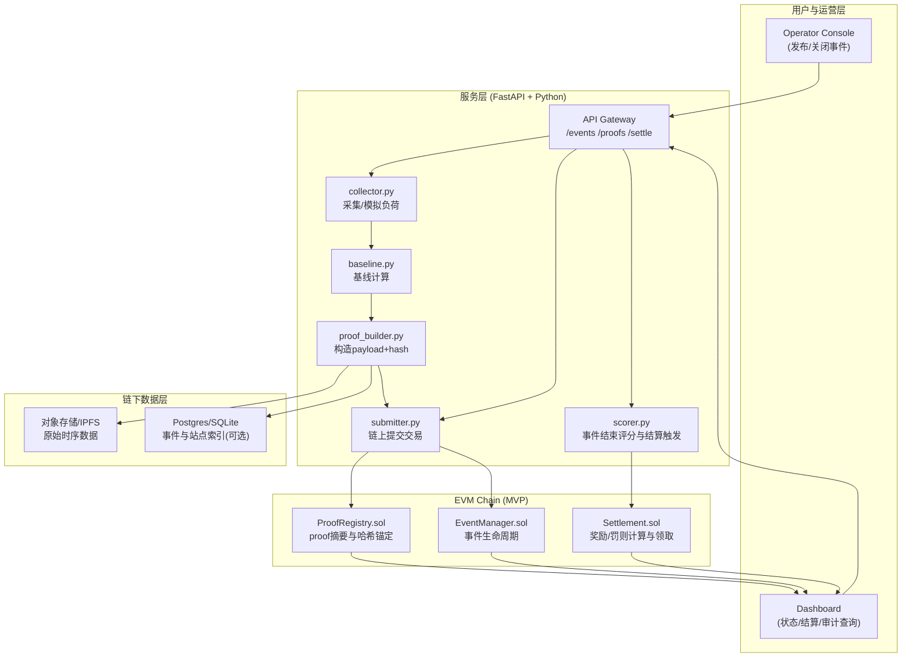
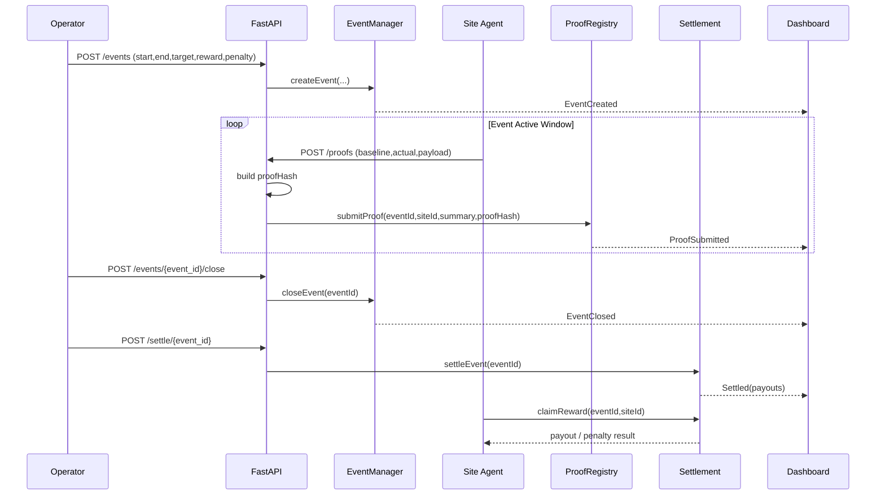

# DR Agent

[English Version (README.md)](README.md)

# DR Agent — 需求响应自动化结算

## 目录指引

### 商业版导航

- [1. 我们解决的问题](#1-我们解决的问题)
- [2. 产品定义](#2-产品定义)
- [3. 为什么是现在](#3-为什么是现在)
- [4. 网络与部署策略](#4-网络与部署策略)
- [5. 目标客户与价值](#5-目标客户与价值)
- [6. 商业模式（MVP 期）](#6-商业模式mvp-期)
- [7. 竞争与差异化](#7-竞争与差异化)
- [8. 风险与应对](#8-风险与应对)
- [9. 已完成进度与后续里程碑（按周）](#9-已完成进度与后续里程碑按周)
- [10. 为什么是我们](#10-为什么是我们)

### 技术版导航

- [0. 本地 5 分钟快速跑通](#0-本地-5-分钟快速跑通)
- [0.1 项目结构](#01-项目结构)
- [1. 开发目标](#1-开发目标)
- [2. 系统架构](#2-系统架构)
- [3. 合约设计（MVP）](#3-合约设计mvp)
- [4. 数据模型](#4-数据模型)
- [5. 链下服务（Python）](#5-链下服务python)
- [6. API（FastAPI）](#6-apifastapi)
- [7. 前端（Mission Cockpit）](#7-前端mission-cockpit)
- [7.1 扩展到产品级的计划](#71-扩展到产品级的计划)
- [8. 已完成进度与后续开发计划（按周）](#8-已完成进度与后续开发计划按周)
- [9. 测试清单](#9-测试清单)
- [10. 安全与边界](#10-安全与边界)
- [11. 演示与部署资产](#11-演示与部署资产)
- [11.1 测试网合约证据](#111-测试网合约证据)

## 1. 我们解决的问题

需求响应（Demand Response, DR）是通过调整终端用户的用电模式，以响应电力系统的激励信号或市场价格波动，实现供需平衡。DR 在现实里有两个长期痛点：

1. 履约不可验证

- 事件下发后，用户是否真实降载、降了多少，常依赖中心化报表。
- 多方（聚合商、用户、电网）之间容易出现数据口径争议。

2. 结算周期长、人工对账重

- 从事件结束到奖励发放通常跨多个系统，效率低且不可审计。
- 中小参与者信任成本高，参与动力不足。

## 2. 产品定义

**DR Agent** 是一个面向 EVM 网络的需求响应自动化结算协议层：

- 事件发布：电网/聚合商发布 DR 事件（时间、目标削减、规则）
- 履约证明：接入方提交可验证的负荷数据证明
- 自动结算：合约按规则发放奖励或扣罚
- 审计追踪：全流程可回放、可验证
- 核心增强：**能源预言机层（Energy Oracle Layer）** 将链下遥测转为链上可验证证据
  （`telemetry -> baseline 推理 -> 置信度元数据 -> proof hash 上链`）

一句话：
**把 DR 从“人盯流程”升级为“可验证执行 + 自动结算”。**

## 3. 为什么是现在

- 电力系统灵活性需求持续增长，DR 参与方增加。
- AI 能提升事件期内调度决策，但缺少统一的可信结算层。
- 模块化 EVM 部署策略更适合多主体、多规则、可审计的能源结算场景。

## 4. 网络与部署策略

1. **链无关合约设计**：核心合约保持 EVM 兼容，在不同执行环境复用同一事件/proof/结算生命周期。
2. **测试网优先验证**：live 模式可在 EVM 测试网产生真实交易证据，且不改变 API 语义。
3. **渐进式加固路径**：本地模拟 -> 测试网真实交易 -> 随协议成熟逐步收紧部署与治理策略。

## 5. 目标客户与价值

### 初始客户（黑客松后 3-6 个月）

- 聚合商 / 能源服务商（管理多个工商业用电点）
- 工商业园区（有削峰需求与激励结算需求）

### 直接价值

- 结算时间从“天/周”缩短到“分钟/小时”
- 降低争议成本（事件、履约、奖励规则全链上留痕）
- 提升参与方信任与复用效率

## 6. 商业模式（MVP 期）

1. 结算服务费（按事件）

- 每次 DR 事件按参与站点数或结算金额收取服务费。

2. API/SaaS 订阅

- 面向聚合商提供事件管理、履约审计、自动报表接口。

3. 企业部署版

- 私有化部署 + 年度维护（后续阶段）

## 7. 竞争与差异化

### 竞品格局

- 传统 DR 平台：业务成熟，但多为中心化流程，审计成本高。
- 泛能源数据平台：有监测能力，但结算闭环弱。

### 我们的差异化

1. **能源预言机层**：baseline 推理 + 置信度元数据 + 证据哈希上链一体化。
2. **链上代币结算**：DRT（ERC-20）在 Claim 时链上转账，补齐结算闭环的价值转移环节。
3. **跨网络流动性（可选）**：DRT 可按需桥接到外部流动性场所。
4. **AI 负荷/算力场景**：从传统工业负荷扩展到 AI 时代柔性算力需求。
5. **M2M 结算与激励**：机器账户驱动可编程激励分发。
6. **模块化成长路径**：测试网 MVP -> 专用执行环境 -> 跨域互操作 -> 领域预编译。

## 8. 风险与应对

1. 合规与责任边界

- 对外定位“结算与审计基础设施”，不做代客调度承诺收益。

2. 数据真实性

- 引入数据签名、设备身份、异常值校验和仲裁流程。

3. 地区规则差异

- 采用“规则模板化”架构，先做单一区域 MVP。

## 9. 已完成进度与后续里程碑

已完成（截至 2026-02-24）：
- 主流程闭环已跑通：`create -> proofs -> close -> settle -> claim -> audit`
- 合约测试稳定通过（`15 passing`）
- 前端三模式、双语切换、证据快照与图形化读数已接入
- 网络集成分析完成：交付范围与长期架构边界已明确

黑客松交付（按优先级）：
- **P0**：DRT 代币（ERC-20）+ `claimReward()` 真实代币转账（约 1 天）
- **P0**：Custom L1 配置蓝图，含多区域扩展架构图（约 0.5 天）
- **P1**：ICTT 跨链代币桥接（ERC20TokenHome + ERC20TokenRemote）（约 1-2 天）
- **P1**：能源预言机层默认接入主路径，落库模型元信息
- **P2**：浏览器链接、Prophet 自动调用

创业愿景（写入路线图文档，不写代码）：
- 6 个月：ICM 多区域证明互认
- 12 个月：自定义预编译 zk-SNARK 证明验证
- 18 个月：HyperSDK DR-VM 原生结算
- 24 个月：验证者经济——电表运营商质押为 DR-L1 验证者

## 10. 为什么是我们

> 华为数字能源工程师，3 年以上光伏系统开发经验，
> 横跨嵌入式固件、AI 优化算法与智能合约开发。

| 领域   | 经验                                          |
| ------ | --------------------------------------------- |
| 能源   | 光伏逆变器固件（嵌入式 C）· PVEMS AI 算法优化 |
| AI     | LSTM 负荷预测 · MILP 调度优化                 |
| 区块链 | Solidity · Chainlink 预言机 · Hardhat         |
| 教育   | 浙江大学本科                                  |

---

# DR Agent — 技术版开发手册

## 0. 本地 5 分钟快速跑通

环境前置：

- 推荐 Node.js 20.x 或 22.x（Node 23 会触发 Hardhat 兼容性告警）。
- Python 3.10+ 且支持 `venv`。

步骤 1：安装依赖并验证合约

```bash
npm install
npm run test:contracts
```

步骤 2：初始化 API Python 环境并执行健康检查

```bash
npm run setup:api
source .venv/bin/activate
```

如果当前机器无法直连 PyPI，可先配置：

```bash
export PIP_INDEX_URL=<内网镜像地址>
# 或
export WHEELHOUSE_DIR=<离线 wheel 包目录>
npm run setup:api
```

步骤 3：初始化工作区外 secrets 文件

```bash
make secrets-init
# 编辑 ~/.config/dr-agent/secrets.env
make secrets-check
```

步骤 4：启动 API（自动加载外置 secrets）

```bash
make api-run
# 可选健康检查
curl http://127.0.0.1:8000/healthz
```

步骤 5：执行演示闭环（新终端）

```bash
make demo-run
```

若要现场演示真实上链（Fuji，默认完整双站点闭环 + hybrid 确认），建议使用：

```bash
export DR_CHAIN_MODE=fuji-live
export DR_TX_CONFIRM_MODE=hybrid
export DR_DEMO_SITE_MODE=dual
make demo-run
# 或
npm run demo:walkthrough:live
```

若现场预算紧张，可临时切到降耗模式：

```bash
export DR_DEMO_SITE_MODE=single
make demo-run
```

演示结束后可在以下位置查看 tx hash：

- 汇总文件：`cache/demo-tx-<event_id>.json`
- 证据汇总：`cache/demo-evidence-<event_id>.json`
- 分步原始响应：`cache/demo-raw-<event_id>/`
- 本地数据库：`cache/dr_agent.db`（`events/proofs/settlements` 表）
- Fuji 实况证据文档（`guide/` 内部归档，live 模式自动生成）

步骤 6：可选启动前端 Mission Cockpit

```bash
npm run frontend:serve
# 浏览器打开 http://127.0.0.1:4173
```

前端默认进入英文 `Mission Cockpit`，并提供三层执行视图：

- 三模式切换：`Story / Ops / Engineering`
- 语言切换：`EN / 中文`（默认 EN，切换后写入 `localStorage['dr_lang']` 并持久化）
- 主操作：`Execute Next Step`、`Auto Run Full Flow`
- Mission Strip：事件、链模式、当前步骤、健康度、延迟
- KPI Grid：Status/Coverage/Payout/Claim/Audit/Latency
- Evidence Deck：Proof A vs Proof B、Audit Anchor、One-Line Story、Agent Insight（技术日志可折叠）
- 主题切换：`Theme: Cobalt/Neon`
- 路演聚焦：`Camera Mode` 自动高亮当前步骤与对应 KPI
- 演示去噪：`Review Mode` 可切换更聚焦的展示态
- 证据导出：`Copy Snapshot` 在 Story/Ops 复制简版摘要，在 Engineering 复制全量（含 JSON 证据）
- 快捷键：`N`（下一步）/ `R`（全流程）/ `E`（切到 Engineering）

补充：

- API 健康检查可单独执行：`npm run smoke:api`
- 完整 Python 依赖（含 Prophet）：`npm run setup:python`
- 使用外置 secrets 的 Fuji 部署：`make deploy-fuji`
- 仅部署 DRT（Fuji）：`make deploy-fuji-drt`
- 仅部署 DRT 并生成证据：`make deploy-fuji-drt-evidence`
- 默认允许前端跨域来源：`http://127.0.0.1:4173,http://localhost:4173`，可用 `DR_CORS_ORIGINS` 覆盖
- 真实上链演示建议先确认：`curl http://127.0.0.1:8000/system/chain-mode`（包含 `tx_confirm_mode`）

## 0.1 项目结构

```text
contracts/                 # 事件生命周期与结算相关 Solidity 合约
services/                  # FastAPI 服务与链下编排逻辑
scripts/                   # 环境初始化、演示、健康检查、部署脚本
test/                      # 合约测试（Hardhat）
tests/                     # API/集成测试（pytest）
frontend/                  # 最小演示前端壳
docs/module-design/        # 模块架构设计文档（主仓库）
docs/adr/                  # 架构决策记录（主仓库）
resources/                 # 参考资料与来源材料
guide/                     # 内部文档模块（不用于外部提交）
```

文档边界说明：

- 对外材料建议仅使用仓库代码、可复现命令、`cache/` 自动生成产物，以及 `docs/module-design/` 模块架构文档。
- `docs/adr/` 与 `resources/` 用于工程架构背景与资料溯源，不属于演示主叙事材料。
- `guide/` 下所有内容均为内部工作文档，不对外提交包暴露。

## 1. 开发目标

在 6 周内完成一个可演示 MVP：

- 事件发布（Event Creation）
- 履约提交（Proof Submission）
- 自动结算（Settlement）
- 审计查询（Audit View）

核心原则：

- 先跑通闭环，再做复杂算法。
- 链上存关键状态，原始时序数据链下保存并哈希上链。

## 2. 系统架构

### 2.1 分层架构图（详细版）


```mermaid
flowchart TB
    subgraph U["用户与运营层"]
        OP["Operator Console\n(发布/关闭事件)"]
        DB["Dashboard\n(状态/结算/审计查询)"]
    end

    subgraph S["服务层 (FastAPI + Python)"]
        API["API Gateway\n/events /proofs /settle"]
        C["collector.py\n采集/模拟负荷"]
        B["baseline.py\n基线计算"]
        P["proof_builder.py\n构造payload+hash"]
        SUB["submitter.py\n链上提交交易"]
        SC["scorer.py\n事件结束评分与结算触发"]
    end

    subgraph O["链下数据层"]
        RAW["对象存储/IPFS\n原始时序数据"]
        IDX["Postgres/SQLite\n事件与站点索引(可选)"]
    end

    subgraph A["EVM Chain (MVP)"]
        EM["EventManager.sol\n事件生命周期"]
        PR["ProofRegistry.sol\nproof摘要与哈希锚定"]
        ST["Settlement.sol\n奖励/罚则计算与领取"]
    end

    OP --> API
    DB --> API
    API --> C --> B --> P
    P --> RAW
    P --> IDX
    P --> SUB --> PR
    API --> SUB --> EM
    API --> SC --> ST
    ST --> DB
    EM --> DB
    PR --> DB
```

### 2.2 核心数据流（谁在链上，谁在链下）

1. `链上`：事件参数、proof 摘要、proof 哈希、结算结果、领取状态。
2. `链下`：高频原始负荷曲线、设备日志、可复算 payload。
3. `一致性锚点`：`proofHash = keccak256(rawPayload)`，审计时复算对比。

### 2.3 事件到结算时序图


```mermaid
sequenceDiagram
    participant O as Operator
    participant API as FastAPI
    participant EM as EventManager
    participant AG as Site Agent
    participant PR as ProofRegistry
    participant ST as Settlement
    participant D as Dashboard

    O->>API: POST /events (start,end,target,reward,penalty)
    API->>EM: createEvent(...)
    EM-->>D: EventCreated

    loop Event Active Window
        AG->>API: POST /proofs (baseline,actual,payload)
        API->>API: build proofHash
        API->>PR: submitProof(eventId,siteId,summary,proofHash)
        PR-->>D: ProofSubmitted
    end

    O->>API: POST /events/{event_id}/close
    API->>EM: closeEvent(eventId)
    EM-->>D: EventClosed

    O->>API: POST /settle/{event_id}
    API->>ST: settleEvent(eventId)
    ST-->>D: Settled(payouts)

    AG->>ST: claimReward(eventId,siteId)
    ST-->>AG: payout / penalty result
```

## 3. 合约设计（MVP）

### 3.1 EventManager.sol

功能：

- createEvent(eventId, start, end, targetKw, rewardRate, penaltyRate)
- closeEvent(eventId)
- getEvent(eventId)

状态：

- Pending / Active / Closed / Settled

### 3.2 ProofRegistry.sol

功能：

- submitProof(eventId, siteId, baselineKwh, actualKwh, proofHash)
- getSiteProof(eventId, siteId)

说明：

- 链上只存摘要值和哈希，原始曲线放 IPFS/对象存储。
- proofHash = keccak256(rawPayload)

### 3.3 Settlement.sol

功能：

- settleEvent(eventId)
- claimReward(eventId, siteId)

结算规则（MVP 简化）：

- reduction = baselineKwh - actualKwh
- completion = reduction / targetShare
- if completion >= 1: reward = targetShare \* rewardRate
- else: reward = reduction _ rewardRate - (targetShare - reduction) _ penaltyRate

## 4. 数据模型

### Event

- eventId: bytes32
- startTime/endTime: uint64
- targetKw: uint256
- rewardRate: uint256
- penaltyRate: uint256
- status: uint8

### SiteProof

- siteId: bytes32
- baselineKwh: uint256
- actualKwh: uint256
- reductionKwh: uint256
- proofHash: bytes32
- submittedAt: uint64

### SettlementRecord

- eventId: bytes32
- siteId: bytes32
- payout: int256
- settledAt: uint64

## 5. 链下服务（Python）

模块：

1. `collector.py`：采集/模拟负荷数据
2. `baseline.py`：生成 baseline（MVP 用近 7 天同小时均值）
3. `proof_builder.py`：构造 payload + hash
4. `submitter.py`：编排 proof 与结算写入（MVP 模拟交易模式）
5. `scorer.py`：事件结束后触发结算

说明：

- 当 `DR_CHAIN_MODE=simulated`（默认）时，服务返回模拟 tx hash。
- 当 `DR_CHAIN_MODE=fuji-live`（或 `fuji`）时，服务会调用 Fuji 合约发送真实交易，并返回真实 tx hash。
- 当 `DR_TX_CONFIRM_MODE=hybrid`（默认）时，写接口快速返回 `tx_state=submitted`，后续读接口异步回填 `tx_fee_wei/tx_confirmed_at`。
- 当 `DR_TX_CONFIRM_MODE=sync` 时，每步等待链上确认后返回手续费与确认状态。

## 6. API（FastAPI）

- `POST /events` 创建事件
- `POST /events/{event_id}/close` 在结算前关闭事件
- `POST /proofs` 提交站点履约
- `POST /settle/{event_id}` 触发结算
- `POST /claim/{event_id}/{site_id}` 触发站点领取结算结果
- `GET /events/{event_id}` 查询事件状态
- `GET /events/{event_id}/records` 查询结算明细
- `GET /audit/{event_id}/{site_id}` 校验 proof hash 一致性
- `GET /judge/{event_id}/summary` 查询执行视角聚合摘要
- `GET /healthz` 服务健康检查
- `GET /system/chain-mode` 输出当前链执行模式 + 确认模式 + 演示站点模式 + 必需 proof 站点集合

## 7. 前端（Mission Cockpit）

当前前端采用“暗色指挥舱 + 跑道路演态”结构，主目标是让读者在 3 分钟内看懂闭环状态：

1. Mission Strip（顶部任务条）

- Event ID、Chain Mode、Current Step、Health、Latency
- Health 仅由主流程步骤判定（不受查询/快照等旁路动作影响）

2. Flow Timeline（流程状态条）

- `create -> proofs -> close -> settle -> claim -> audit`
- 每一步有 `pending / in-progress / done / error` 状态
- 当前步骤带跑道流光效果；`Camera Mode` 会自动聚焦当前步骤
- Health 仅由主流程步骤判定（查询/快照动作不会覆盖主流程健康度）

3. KPI Grid（核心结果）

- Status、Proof Coverage、Total Payout、Claim(site-a)、Audit Match、Latency
- 数值变化时有短时高亮动效，提升路演可感知性

4. Evidence Deck（证据层）

- Proof A / Proof B 对比摘要
- Audit hash 摘要（on-chain vs recomputed）
- One-Line Story（<=120 字符）
- 可一键 `Copy Snapshot`：Story/Ops 输出简版摘要；Engineering 输出全量（含 JSON 证据）
- 真实上链状态语义：`submitted / confirmed / failed` 会在 KPI 提示与技术日志中同步显示

5. Technical Evidence（折叠日志）

- 默认可折叠，点击 `View Technical Evidence` 查看原始 JSON
- 采用日志裁剪上限，避免长时间演示卡顿

6. Theme 与舞台模式

- 默认 `Cobalt`（可读性优先），可切换 `Neon`（舞台冲击力优先）

7. 演示快捷键

- `N`：执行下一步（Execute Next Step）
- `R`：自动全流程（Auto Run Full Flow）
- `E`：切换到 Engineering 模式

8. `Auto Run Full Flow` 实际执行顺序

- `createEvent -> submitProof(site-a) -> submitProof(site-b) -> closeEvent -> settleEvent -> claim(site-a) -> getAudit`

### 7.1 扩展到产品级的计划

1. 类型化 API 与领域模型

- 统一使用类型化客户端访问后端接口，避免页面散落原始请求。
- 保持前端数据结构与后端响应契约同步更新。

2. 认证、权限与异常态体验

- 按 operator / participant / auditor 明确操作边界。
- 核心页面覆盖 loading、空状态、过期状态、错误状态。

3. 可观测性与审计一致性

- 前端关键操作事件统一埋点并携带 trace 标识。
- 确保页面操作记录与链上事件、服务日志可对齐。

4. 发布前加固与 E2E 质量门

- 建立事件发布、履约提交、触发结算、审计查询的端到端测试。
- 在演示或发布前执行统一 release checklist。

## 8. 已完成进度与后续开发计划（按周）

### 已完成进度（截至 2026-02-24）

1. MVP 闭环已跑通：
- `create -> proofs -> close -> settle -> claim -> audit`
- 合约测试持续全绿（`15 passing`）。

2. 真实链演示能力已具备：
- `DR_CHAIN_MODE=fuji-live` 可执行真实 Fuji 交易。
- 已接入 `submitted/confirmed/failed` 状态语义与证据输出链路。

3. Mission Cockpit 可演示性已达标：
- `Story / Ops / Engineering` 三模式
- `Execute Next Step` / `Auto Run Full Flow`
- EN/中文切换与持久化
- 动态 KPI/证据展示与快照导出

4. Story 模式图形证据已补齐：
- baseline vs actual 图表
- payout breakdown 图表

5. 网络集成分析完成：
- 黑客松交付范围：DRT 代币 + ICTT 桥接 + Custom L1 蓝图
- 创业愿景范围：ICM 多区域 + 自定义预编译 + HyperSDK + 验证者经济

### 执行计划

1. DRT 代币 + claimReward 转账（P0，约 1 天）
- 部署 `DRToken.sol`（ERC-20，初始铸造到 Settlement 合约）。
- 修改 `Settlement.sol`，Claim 时调用 `rewardToken.transfer()`。
- 前端展示 DRT 代币余额。

2. Custom L1 配置蓝图（P0，约 0.5 天）
- `genesis.json` 配置：`txAllowList`、`deployerAllowList`、自定义费率参数。
- 技术论证：为什么 DR 结算需要专属 L1。
- 多区域扩展架构图（ICM 愿景载体）。

3. ICTT 跨链代币桥接（P1，约 1-2 天）
- 在 Fuji C-Chain 部署 `ERC20TokenHome`。
- 在测试 L1 部署 `ERC20TokenRemote`。
- 演示 DRT 跨链转移流程。

4. 能源预言机层默认接入（P1）
- 将 `telemetry -> baseline -> confidence -> proof hash` 作为默认 proof 生成链路。
- 落库并返回 `baseline_method`、`baseline_model_version`、`baseline_confidence`。

5. 收尾与证据打磨（P2）
- 浏览器链接（前端约 10 行）。
- Prophet 自动调用（后端约 30 行）。

## 9. 测试清单

### 合约测试

1. 正常流程：创建、提交、结算、领取
2. 重复提交防重
3. 非法时间窗口拒绝
4. 未关闭事件不能结算
5. 结算后不可重复结算

### 集成测试

1. 事件期内持续上报
2. 仅在显式关闭事件后才允许结算
3. 前端数据与链上数据一致

### 演示测试

1. 5 分钟内完整跑通
2. 随机抽查 proofHash 可复算
3. 异常场景可解释

## 10. 安全与边界

1. 权限控制

- 仅 operator 可创建/关闭事件
- 仅 participant 角色可提交 proof（站点注册机制为后续增强项）

2. 数据完整性

- payload 签名 + hash 上链
- 保留原始数据审计窗口

3. 非目标范围（MVP）

- 不做真实电网调度接管
- 不做复杂市场规则引擎
- 不做跨法域合规模块

## 11. 演示与部署资产

- 前端演示壳：`frontend/index.html`
- 前端逻辑：`frontend/app.js`
- 前端样式：`frontend/styles.css`
- 一键演示脚本：`scripts/demo_walkthrough.sh`
- 路演 PPT 同步脚本：`scripts/sync_pitch_pptx.py`
- 最终演示 PPT（PPTX）：`guide/ppt/DR-Agent-Verifiable-Demand-Response-Auto-Settlement-final.pptx`
- API 环境初始化脚本：`scripts/setup_python_env.sh`
- API 健康检查脚本：`scripts/smoke_api_flow.py`
- Fuji 部署脚本：`scripts/deploy_fuji.ts`
- DRT-only Fuji 部署脚本：`scripts/deploy_drt_fuji.ts`
- 执行证据脚本：`scripts/build_execution_evidence_bundle.py`
- DRT-only 证据包脚本：`scripts/build_drt_evidence_bundle.py`
- 演示交易汇总：`cache/demo-tx-<event_id>.json`
- 演示证据汇总：`cache/demo-evidence-<event_id>.json`
- 分步原始响应：`cache/demo-raw-<event_id>/`
- 模块架构文档（主仓库）：`docs/module-design/`
- 架构决策记录（主仓库）：`docs/adr/`
- 参考资料（主仓库）：`resources/`
- 内部文档模块（不外部暴露）：`guide/`

## 11.1 测试网合约证据

当前状态：

- 已于 `2026-02-20` 完成 Fuji 部署。
- 证据产物路径：`cache/fuji-deployment-latest.json`（内部 Markdown 证据包归档于 `guide/`）。
- DRT-only 证据产物路径：`cache/fuji-drt-deployment-latest.json`（内部 Markdown 证据包归档于 `guide/`）。

当前记录：

| Network | Item                     | Value                                                                | Explorer URL                                                                                       |
| ------- | ------------------------ | -------------------------------------------------------------------- | -------------------------------------------------------------------------------------------------- |
| Fuji    | Deployer                 | `0xdC1DE25053196bb72e09db43EE34181D1e65cF0A`                         | -                                                                                                  |
| Fuji    | EventManager             | `0x388C76A617d67137CCF91A3C9B48c0779502484c`                         | https://testnet.snowtrace.io/address/0x388C76A617d67137CCF91A3C9B48c0779502484c                    |
| Fuji    | ProofRegistry            | `0x05689d6aa1f83ed4854EA0F84f7f96B48133750D`                         | https://testnet.snowtrace.io/address/0x05689d6aa1f83ed4854EA0F84f7f96B48133750D                    |
| Fuji    | Settlement               | `0x69512B18109BA25Df3A5cA27d30521EE60b7a787`                         | https://testnet.snowtrace.io/address/0x69512B18109BA25Df3A5cA27d30521EE60b7a787                    |
| Fuji    | setSettlementContract tx | `0xaffbb344ecfec8601313ec452e857f31346c72c5ba0a1e6b6166315b38a2831f` | https://testnet.snowtrace.io/tx/0xaffbb344ecfec8601313ec452e857f31346c72c5ba0a1e6b6166315b38a2831f |

最新 DRT-only 证据索引：

- 生成时间（UTC）：`2026-03-06T11:31:13Z`
- DRT 合约地址：`0x7c3B54f956D95E7F5756dE7684Cf5D893556E6B2`  
  浏览器链接：https://testnet.snowtrace.io/address/0x7c3B54f956D95E7F5756dE7684Cf5D893556E6B2
- 部署交易：`0x3aa757cfc293be3a801d663306cd3142ffc91a62eb177947809ff4d5d98ecdef`  
  浏览器链接：https://testnet.snowtrace.io/tx/0x3aa757cfc293be3a801d663306cd3142ffc91a62eb177947809ff4d5d98ecdef
- 部署总手续费（wei）：`1977874`
- 一键复现命令：`npm run deploy:fuji:drt:evidence`
- 详细证据路径：
  `cache/fuji-drt-deployment-latest.json`、
  `guide/docs/Fuji-DRT-Evidence-Bundle-latest.md`

维护步骤：

1. 如需重部署，执行 `npm run deploy:fuji`。
2. 执行 `npm run evidence:execution` 刷新证据包。
3. 如需仅部署 DRT，执行 `npm run deploy:fuji:drt`。
4. 如需仅生成 DRT 证据，执行 `npm run evidence:execution:drt`（或一键 `npm run deploy:fuji:drt:evidence`）。
5. 保持本表与 `cache/` 自动产物一致；`guide/` 内部文档按需同步。

## 11.2 阶段2 72小时最小可获奖提交包

DRT-only 一键部署并生成证据：

```bash
npm run deploy:fuji:drt:evidence
# 或
make deploy-fuji-drt-evidence
```

若缺少 `@openzeppelin/contracts` 依赖：

```bash
npm i -D @openzeppelin/contracts
```

3 天执行优先级：

1. Day 1（P0）：固定可复现 Fuji 全流程，沉淀最小证据集（`event_id`、6 步 tx hash、`tx_state`、总费用、审计匹配、浏览器链接）。
2. Day 2（P1）：收敛演示体验（Story 模式 4 核心卡、延迟拆解、失败一键重试+可执行提示）。
3. Day 3（P2）：封版录制（<=5 分钟）、README 与证据同步、关键命令回归复跑。

5 分钟演示时间轴：

1. `0:00-0:40` 讲痛点。  
2. `0:40-1:40` 讲方案架构。  
3. `1:40-3:30` 实机演示 6 步并展示 tx/audit 证据。  
4. `3:30-4:20` 展示证据包。  
5. `4:20-5:00` 讲价值和 4 周路线。

提交问答（英文 <=250 chars + 中文口径）已移动到：

- `guide/stage2/stage2-submission-qa.md`

内部完整执行文档（历史归档）：`guide/docs/history/legacy-competition/DR-Agent-stage2-72h-min-winning-plan-2026-03-06.md`
