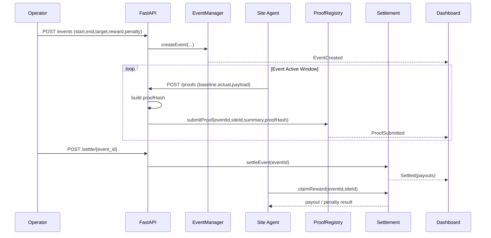

# DR Agent

[English Version (README.md)](README.md)

## 为什么是我们

> 华为数字能源工程师，3 年以上光伏系统开发经验，
> 横跨嵌入式固件、AI 优化算法与智能合约开发。

| 领域 | 经验 |
|------|------|
| 能源 | 光伏逆变器固件（嵌入式 C）· PVEMS AI 算法优化 |
| AI | LSTM 负荷预测 · MILP 调度优化 |
| 区块链 | Solidity · Chainlink 预言机 · Hardhat |
| 教育 | 浙江大学本科 |

---

## 商业版完整内容

# DR Agent — 需求响应自动化结算（商业版）

---

## 1. 我们解决的问题

需求响应（Demand Response, DR）在现实里有两个长期痛点：

1. 履约不可验证

- 事件下发后，用户是否真实降载、降了多少，常依赖中心化报表。
- 多方（聚合商、用户、电网）之间容易出现数据口径争议。

2. 结算周期长、人工对账重

- 从事件结束到奖励发放通常跨多个系统，效率低且不可审计。
- 中小参与者信任成本高，参与动力不足。

## 2. 产品定义

**DR Agent** 是一个运行在 Avalanche 的需求响应自动化结算协议层：

- 事件发布：电网/聚合商发布 DR 事件（时间、目标削减、规则）
- 履约证明：接入方提交可验证的负荷数据证明
- 自动结算：合约按规则发放奖励或扣罚
- 审计追踪：全流程可回放、可验证

一句话：
**把 DR 从“人盯流程”升级为“可验证执行 + 自动结算”。**

## 3. 为什么是现在

- 电力系统灵活性需求持续增长，DR 参与方增加。
- AI 能提升事件期内调度决策，但缺少统一的可信结算层。
- Avalanche 的应用链与跨链消息能力，适合多主体、多规则、可审计的能源结算场景。

## 4. 为什么是 Avalanche（不是泛链叙事）

1. 低延迟与确定性结算：适合事件触发后的准实时流程。
2. 可定制 L1（Subnet）：可将能源行业规则固化为专用链参数。
3. Interchain 互操作：数据链、资产链、结算链可拆分并协同。

## 5. 目标客户与价值

### 初始客户（黑客松后 3-6 个月）

- 聚合商 / 能源服务商（管理多个工商业用电点）
- 工商业园区（有削峰需求与激励结算需求）

### 直接价值

- 结算时间从“天/周”缩短到“分钟/小时”
- 降低争议成本（事件、履约、奖励规则全链上留痕）
- 提升参与方信任与复用效率

## 6. 商业模式（MVP 期）

1. 结算服务费（按事件）

- 每次 DR 事件按参与站点数或结算金额收取服务费。

2. API/SaaS 订阅

- 面向聚合商提供事件管理、履约审计、自动报表接口。

3. 企业部署版

- 私有化部署 + 年度维护（后续阶段）

## 7. 竞争与差异化

### 竞品格局

- 传统 DR 平台：业务成熟，但多为中心化流程，审计成本高。
- 泛能源数据平台：有监测能力，但结算闭环弱。

### 我们的差异化

1. **结算自动化**：不是只做监控面板。
2. **履约可验证**：对账争议可链上复现。
3. **规则可编程**：不同地区可配置不同结算规则模板。

## 8. 黑客松评审映射（Avalanche 视角）

1. Builder Drive

- 聚焦真实行业流程痛点，不是概念型 Agent。

2. Execution

- Demo 展示完整闭环：事件发布 → 响应执行 → 自动结算 → 审计可视化。

3. Crypto Culture

- 链上状态机承担核心职责（不是“Web2 + 上链存证”）。

4. Long-term Intent

- 可先服务单一地区/单一聚合商，再扩展到跨地区规则网络。

## 9. Demo 设计（5 分钟）

1. 发布一个 DR 事件（目标削减 300kW，持续 60 分钟）
2. 两个站点提交履约数据证明
3. 合约自动计算完成率与奖励
4. 前端展示结算流水与审计日志
5. 对比传统手工流程耗时

## 10. 风险与应对

1. 合规与责任边界

- 对外定位“结算与审计基础设施”，不做代客调度承诺收益。

2. 数据真实性

- 引入数据签名、设备身份、异常值校验和仲裁流程。

3. 地区规则差异

- 采用“规则模板化”架构，先做单一区域 MVP。

## 11. 里程碑（建议）

- Week 1-2：事件模型 + 结算合约
- Week 3-4：数据证明与自动评分 + 基础前端
- Week 5-6：端到端压测与演示脚本固化

结论：
**DR Agent 是一个"可执行、可审计、可商业化"的 Avalanche 原生能源应用，适合黑客松被看见并延展到创业。**

---

## 技术版完整内容

# DR Agent — 技术版开发手册

## 1. 开发目标

在 6 周内完成一个可演示 MVP：

- 事件发布（Event Creation）
- 履约提交（Proof Submission）
- 自动结算（Settlement）
- 审计查询（Audit View）

核心原则：

- 先跑通闭环，再做复杂算法。
- 链上存关键状态，原始时序数据链下保存并哈希上链。

## 2. 系统架构

### 2.1 分层架构图（详细版）

### 2.2 核心数据流（谁在链上，谁在链下）

1. `链上`：事件参数、proof摘要、proof哈希、结算结果、领取状态。
2. `链下`：高频原始负荷曲线、设备日志、可复算payload。
3. `一致性锚点`：`proofHash = keccak256(rawPayload)`，审计时复算对比。

### 2.3 事件到结算时序图

## 3. 合约设计（MVP）

### 3.1 EventManager.sol

功能：

- createEvent(eventId, start, end, targetKw, rewardRate, penaltyRate)
- closeEvent(eventId)
- getEvent(eventId)

状态：

- Pending / Active / Closed / Settled

### 3.2 ProofRegistry.sol

功能：

- submitProof(eventId, siteId, baselineKwh, actualKwh, proofHash)
- getSiteProof(eventId, siteId)

说明：

- 链上只存摘要值和哈希，原始曲线放 IPFS/对象存储。
- proofHash = keccak256(rawPayload)

### 3.3 Settlement.sol

功能：

- settleEvent(eventId)
- claimReward(eventId, siteId)

结算规则（MVP 简化）：

- reduction = baselineKwh - actualKwh
- completion = reduction / targetShare
- if completion >= 1: reward = targetShare \* rewardRate
- else: reward = reduction _ rewardRate - (targetShare - reduction) _ penaltyRate

## 4. 数据模型

### Event

- eventId: bytes32
- startTime/endTime: uint64
- targetKw: uint256
- rewardRate: uint256
- penaltyRate: uint256
- status: uint8

### SiteProof

- siteId: bytes32
- baselineKwh: uint256
- actualKwh: uint256
- reductionKwh: uint256
- proofHash: bytes32
- submittedAt: uint64

### SettlementRecord

- eventId: bytes32
- siteId: bytes32
- payout: int256
- settledAt: uint64

## 5. 链下服务（Python）

模块：

1. `collector.py`：采集/模拟负荷数据
2. `baseline.py`：生成 baseline（MVP 用近7天同小时均值）
3. `proof_builder.py`：构造 payload + hash
4. `submitter.py`：调用合约提交 proof
5. `scorer.py`：事件结束后触发结算

## 6. API（FastAPI）

- `POST /events` 创建事件
- `POST /proofs` 提交站点履约
- `POST /settle/{event_id}` 触发结算
- `GET /events/{event_id}` 查询事件状态
- `GET /events/{event_id}/records` 查询结算明细

## 7. 前端（最小页面）

1. 事件列表页

- 状态、目标、时间窗口、参与站点数

2. 事件详情页

- 站点完成率、奖励结果、proofHash

3. 审计页

- 输入 eventId/siteId 查看链上记录与链下 payload hash 对比

## 8. 开发计划（3 周）

### Week 1

- 完成 3 个核心合约与单测
- 本地脚本跑通：createEvent → submitProof → settle

### Week 2

- FastAPI 封装链交互
- 前端接入查询与触发操作
- 接入 2-3 个站点模拟数据

### Week 3

- 增加异常场景（延迟提交、数据缺失、未达标）
- 固化演示脚本和录像流程

## 9. 测试清单

### 合约测试

1. 正常流程：创建、提交、结算、领取
2. 重复提交防重
3. 非法时间窗口拒绝
4. 未关闭事件不能结算
5. 结算后不可重复结算

### 集成测试

1. 事件期内持续上报
2. 事件结束后自动结算
3. 前端数据与链上数据一致

### 演示测试

1. 5 分钟内完整跑通
2. 随机抽查 proofHash 可复算
3. 异常场景可解释

## 10. 安全与边界

1. 权限控制

- 仅 operator 可创建/关闭事件
- 仅注册站点可提交 proof

2. 数据完整性

- payload 签名 + hash 上链
- 保留原始数据审计窗口

3. 非目标范围（MVP）

- 不做真实电网调度接管
- 不做复杂市场规则引擎
- 不做跨法域合规模块
