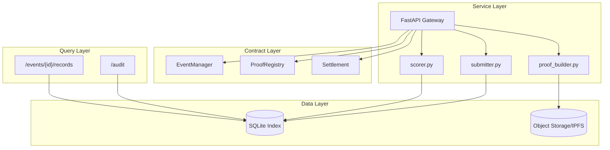

# DR-Agent MVP 模块总览

## 目标
在 MVP 阶段打通闭环：`create event -> submit proof -> close event -> settle -> claim -> audit`。

## 分层架构

## 端到端时序
1. `POST /events`：operator 创建事件。
2. `POST /proofs`：participant 上报 proof 与 raw payload 摘要。
3. `POST /events/{event_id}/close`：operator 关闭事件。
4. `POST /settle/{event_id}`：operator 触发结算。
5. `POST /claim/{event_id}/{site_id}`：proof 提交者领取。
6. `GET /audit/{event_id}/{site_id}`：auditor 复算 hash 对账。

## 关键边界
1. 链上仅记录关键状态与 proof hash。
2. 原始 payload 存链下 URI，查询层只负责复算核验。
3. 写操作全部要求 API Key + role，写接口返回 trace_id。
